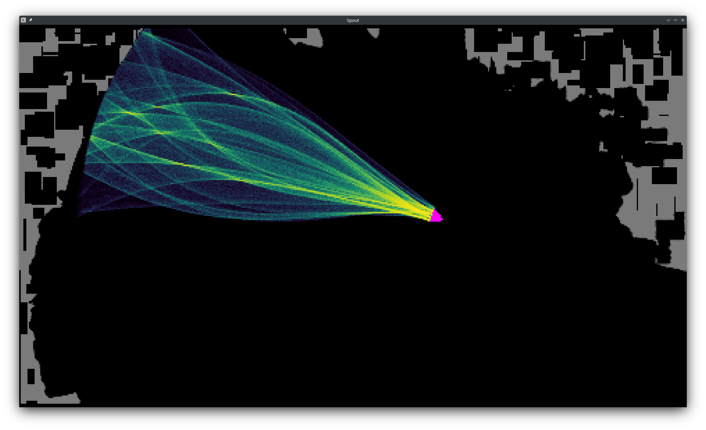
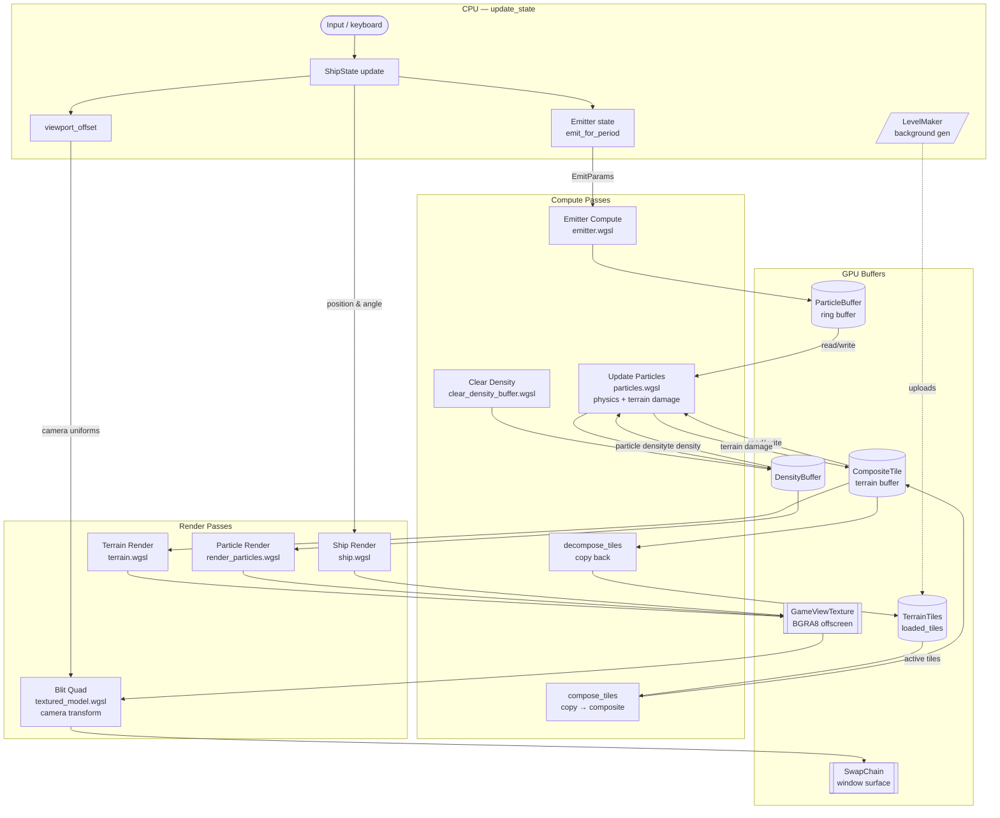

[](https://github.com/glalonde/spout/actions)

# Spout Web version



Live streaming some of the programming ony my youtube channel: [https://youtu.be/QauR0n0V48M](https://youtu.be/QauR0n0V48M) 

Legacy version is in branch `legacy_wgpu`. It's actually in a more complete state, but is based on older libraries. I'm in the process of getting back to the same functionality now.

## Per-Frame Pipeline

Each frame the CPU updates game state, then enqueues a single `CommandEncoder` with compute and render passes in order:



> The DOT source for this diagram is at [`assets/pipeline.dot`](assets/pipeline.dot).

## Web Dev Notes

Try visiting the demo at [https://glalonde.github.io/spout/](https://glalonde.github.io/spout/)

Try running the wasm version! It might work:
```
./run_wasm.sh
```

Currently this only works on a few browser configs.

## Firefox Nightly
- Go to [about:config](about:config)
- Set `dom.webgpu.enabled` to true
- Set `gfx.webrender.all` to true